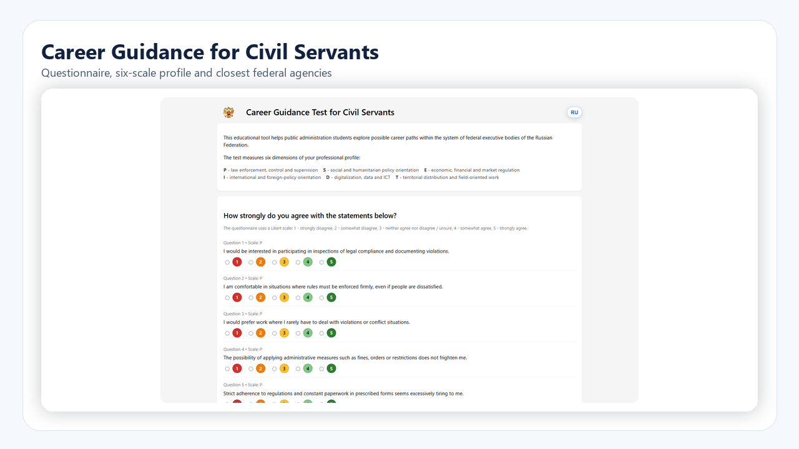
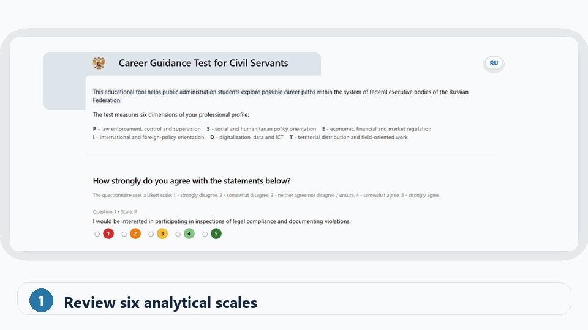
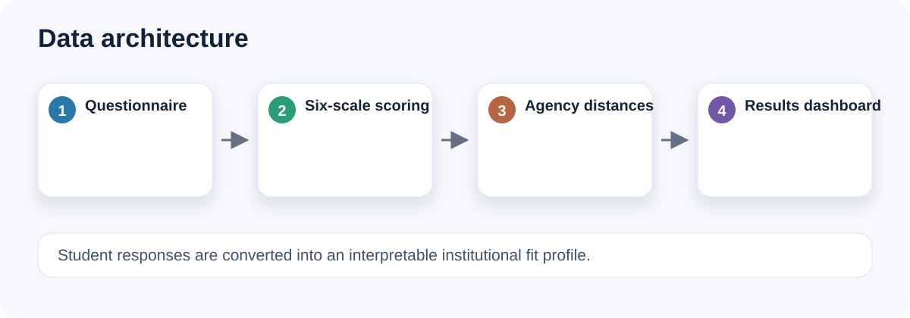
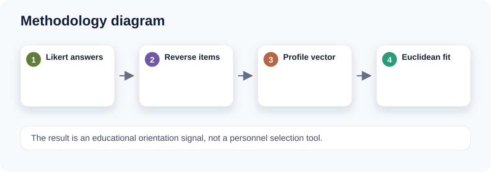
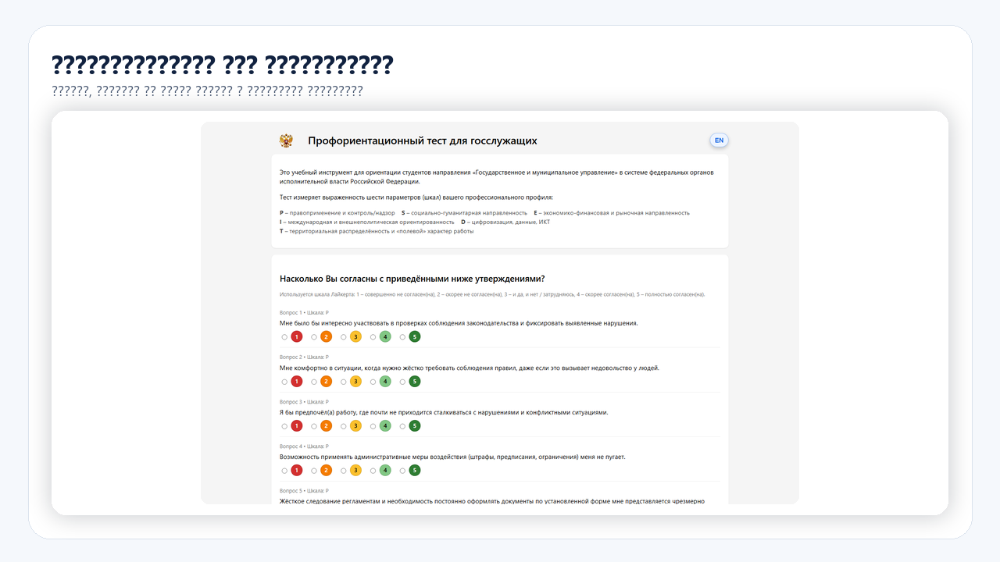
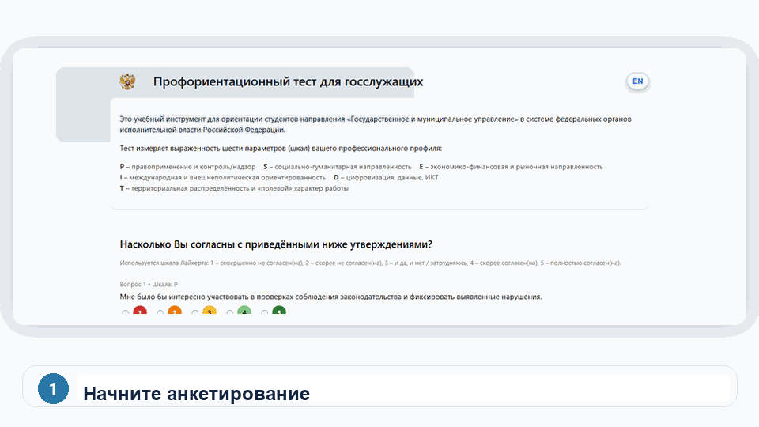

# Career Guidance for Civil Servants · Public Administration Orientation Test

[English](#english) · [Русский](#русский)

[](https://arseniy24rus.github.io/career-guidance-for-civil-servants/)
[](LICENSE)
[](https://creativecommons.org/licenses/by/4.0/)

---

## English

### Overview

`career-guidance-for-civil-servants` is an educational web tool for helping students of public administration reflect on potential career trajectories within the system of federal executive bodies. The application presents a questionnaire, calculates a multidimensional profile and suggests the closest institutional matches based on the user’s answers.

The project is designed for teaching and orientation rather than psychological diagnosis. It helps students discuss the diversity of public-sector roles, compare their interests with functional profiles of government bodies and better understand how different competencies relate to public administration careers.

### Live test

GitHub Pages: <https://arseniy24rus.github.io/career-guidance-for-civil-servants/>

### Visual overview









### Conceptual model

The questionnaire uses six analytical scales:

```text
P  Law enforcement, control and supervision
S  Social and humanitarian policy
E  Economic, financial and market regulation
I  International and foreign-policy orientation
D  Digitalization, data and ICT
T  Territorial and field-oriented work
```

Respondents evaluate statements using a 1–5 Likert-type scale. The application summarizes answers into a profile, visualizes the result as a radar chart and identifies the five closest federal executive bodies. Similarity is calculated through a distance-based logic, using squared Euclidean distance between the respondent profile and institutional profiles.

### Repository structure

```text
gerb_rf.png  Image asset used in the interface
index.html   Single-page questionnaire application
README.md    Project documentation
```

### Local launch

```bash
python -m http.server 8000
```

Then open <http://localhost:8000/>.

### Educational use

The tool can be used at the beginning of a course on public administration, in career-guidance seminars or in modules on the structure of federal executive power. Recommended classroom use is to combine individual test results with group discussion: why certain institutions appear as matches, which competencies are emphasized, and how public-sector career paths differ by function.

### Interpretation and limitations

The test is not a professional psychological assessment and should not be used for employment selection. It is a didactic instrument. The results depend on the selected statements, scale definitions and institutional profiles. They should be interpreted as a structured prompt for reflection rather than as a final career recommendation.

### Citation

If you use the tool in teaching, methodological materials or presentations, please cite:

> Sitkovskiy, A. M. (2026). Career Guidance for Civil Servants: public administration orientation test. GitHub. https://github.com/Arseniy24RUS/career-guidance-for-civil-servants

### License

Unless otherwise stated, source code is released under the MIT License. Educational text, scale descriptions and documentation are released under Creative Commons Attribution 4.0 International (CC BY 4.0). Third-party visual assets, if any, remain subject to their own terms.

---

## Русский

### Обзор

`career-guidance-for-civil-servants` — образовательный веб-инструмент, помогающий студентам направления государственного и муниципального управления осмыслить возможные карьерные траектории в системе федеральных органов исполнительной власти. Приложение предлагает анкету, рассчитывает многомерный профиль и показывает наиболее близкие институциональные варианты на основе ответов пользователя.

Проект предназначен для преподавания и профориентации, а не для психологической диагностики. Он помогает студентам обсуждать разнообразие ролей в публичном секторе, сопоставлять свои интересы с функциональными профилями государственных органов и лучше понимать, как разные компетенции соотносятся с карьерой в государственном управлении.

### Публичный тест

GitHub Pages: <https://arseniy24rus.github.io/career-guidance-for-civil-servants/>

### Визуальный обзор






### Концептуальная модель

Анкета использует шесть аналитических шкал:

```text
P  Правоохранительная, контрольная и надзорная деятельность
S  Социальная и гуманитарная политика
E  Экономическое, финансовое и рыночное регулирование
I  Международная и внешнеполитическая ориентация
D  Цифровизация, данные и ИКТ
T  Территориальная и выездная работа
```

Респондент оценивает утверждения по шкале Лайкерта от 1 до 5. Приложение суммирует ответы в профиль, визуализирует результат в виде радарной диаграммы и определяет пять наиболее близких федеральных органов исполнительной власти. Близость рассчитывается через дистанционную логику, использующую квадрат евклидова расстояния между профилем респондента и институциональными профилями.

### Структура репозитория

```text
gerb_rf.png  Изображение, используемое в интерфейсе
index.html   Одностраничное приложение анкеты
README.md    Документация проекта
```

### Локальный запуск

```bash
python -m http.server 8000
```

Затем откройте <http://localhost:8000/>.

### Учебное применение

Инструмент можно использовать в начале курса по государственному управлению, на профориентационных семинарах или в модулях, посвящённых структуре федеральной исполнительной власти. Рекомендуемый формат работы — сочетать индивидуальное прохождение теста с групповой дискуссией: почему те или иные органы оказываются близкими, какие компетенции подчёркиваются и как различаются карьерные траектории по функциям публичного сектора.

### Интерпретация и ограничения

Тест не является профессиональной психологической оценкой и не должен использоваться для кадрового отбора. Это дидактический инструмент. Результаты зависят от выбранных утверждений, определения шкал и институциональных профилей. Их следует трактовать как структурированный повод для размышления, а не как окончательную карьерную рекомендацию.

### Как цитировать

При использовании инструмента в преподавании, методических материалах или презентациях, пожалуйста, цитируйте:

> Ситковский А. М. Career Guidance for Civil Servants: public administration orientation test. GitHub, 2026. https://github.com/Arseniy24RUS/career-guidance-for-civil-servants

### Лицензия

Если явно не указано иное, исходный код распространяется по лицензии MIT. Учебные тексты, описания шкал и документация распространяются по лицензии Creative Commons Attribution 4.0 International (CC BY 4.0). Сторонние визуальные материалы, если они используются, сохраняют собственные условия использования.
